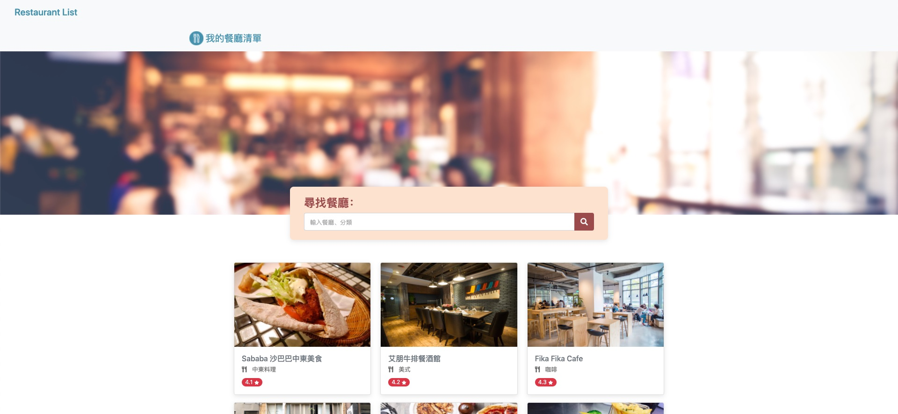

# Restaurant List



## Features
* Give you a list of good restaurants
* Search restaurant by name or category
* Check each restaurant's details by clicking into it, including
  * category
  * address
  * phone number
  * description

## Getting Started

Clone repository to your local computer

```bash
$ git clone https://github.com/elliotyou/restaurant_list.git
```

Into the project folder

```bash
$ cd restaurant_list
```

Install by npm

```bash
$ npm install
$ npm i nodemon
```

Execute

```bash
npm run dev
```


## Built with
 * Node.js: 14.16.1
 * Express: 4.17.1
 * Express-Handlebars: 5.3.0


## Author
Elliot You 游鎮名